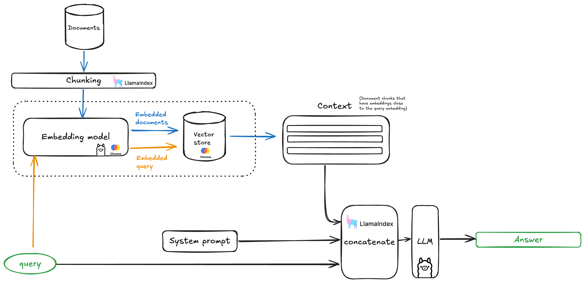

# Introduction to RAG workshop

## Intro

This workshop will introduce how Retrieval-Augmented Generation (RAG) works and how to set up a RAG system on your own device using Ollama, LlamaIndex, and Chroma DB. You’ll explore how RAG improves AI-generated responses by retrieving relevant information from a vector database. We’ll guide you through installing and configuring the necessary tools and demonstrate how to store and query your data. By the end, you’ll be able to efficiently retrieve and generate answers based on your local documents!


## What is RAG?



<!-- TODO: link to the slides -->


## Table of contents


| Content    | Time estimate | Description
| -------- | ------- | ------- |
|     Exercise 0     | 10 minutes   | Getting your python environment ready |
|     Exercise 1     | 20 minutes   |  Get started with Ollama |
|     Exercise 2     | 20 minutes   | Create a Vector Database |
|     Exercise 3     | 40 minutes   |Your first RAG |
|     Exercise 4     | 40 minutes   | Explore further |


## Pre-requisits

### Hardware / software
- Mac with M1, try to sit next to someone that has one otherwise
- Python 3.10 or higher, or conda installed, we'll guide you through that after if you need it

### Knowledge

Basic python


### Setting up your python environment
Install anaconda with the instruction from their website [here](https://docs.anaconda.com/miniconda/#miniconda)

Then create a virtual environment with python 3.11:
```
conda create env --name workshopenv python==3.11
```

Activate the environment then install the required python  packages using pip:
```
conda activate workshopenv
pip install -r requirements.txt
```

### Installing ollama and downloading the llm and embedding models

Download and install ollama from here
https://ollama.com/download/

As part of installing the python environment, you already installed the [ollama](https://pypi.org/project/ollama/) python package.

Now download and install the llama3 and the nomic embed model: 
```
ollama pull llama3
```
Run the llama3 model and write some prompts:
```
ollama run llama3
```

> In case you run into an error here like `Error: [0] server cpu not listed in available servers map` just close ollama from its icon in the top of your screen and open it again.

Pull an embedding model:
```
ollama pull mxbai-embed-large
```
</details> 


